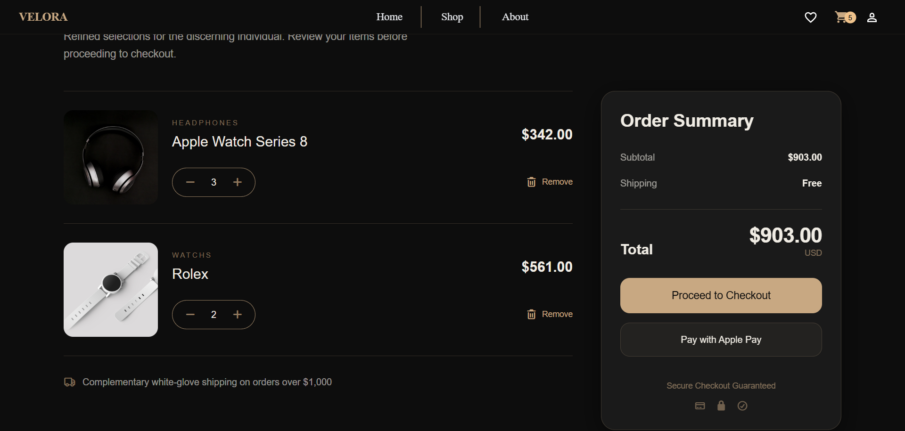

# 🛍️ E-Commerce Website

A modern and responsive E-Commerce web application built with React, Tailwind CSS, and GSAP, providing a smooth and engaging shopping experience.

## 🚀 Features

- Responsive Design for all devices
- Product Listing & Categories
- Product Details Page
- Advanced Filtering & Sorting
- Shopping Cart Management
- Wishlist Functionality
- Smooth Animations with GSAP
- Modern UI with Tailwind CSS
- Fast Navigation using React Router
- Optimized Performance

## 🛠️ Technologies Used

- React.js
- Vite
- Tailwind CSS
- GSAP
- React Router DOM
- Material UI

## ⚡ Installation

Clone the repository:

```bash
git clone https://github.com/Basem6/Velora
```

Navigate to the project directory:

```bash
cd Velora
```

Install dependencies:

```bash
npm install
```

Run the development server:

```bash
npm run dev
```

## 🎯 Future Improvements

- User Authentication
- Payment Gateway Integration
- Order Tracking
- Product Reviews & Ratings

## 👨‍💻 Author

**Basem Mahmoud**

Frontend Developer passionate about creating modern, interactive, and user-friendly web experiences.

### Connect with me

- LinkedIn: https://www.linkedin.com/in/basem-mahmoud-831162399/
- GitHub: https://github.com/Basem6/
